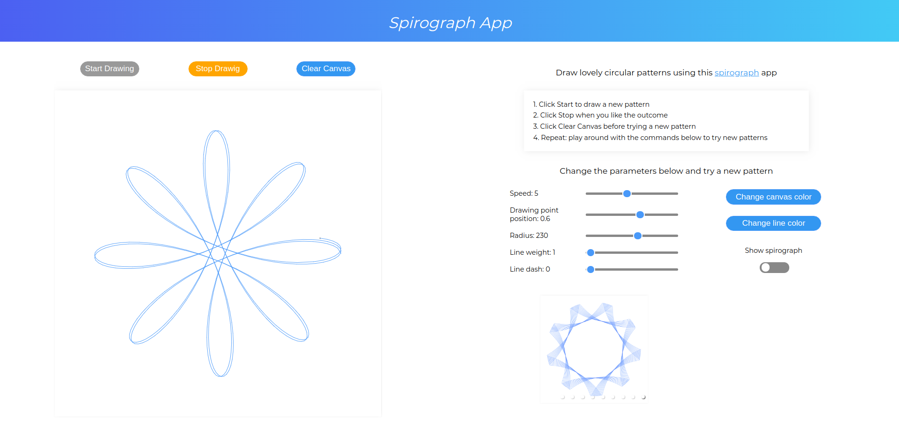

## Spirograph App

## [Demo](https://frosty-raman-e9f7d7.netlify.com/)

## Quick view

## Description

This is a drawing app that makes mathematical roulette curves and draws circular patterns. You can learn about spirographs [here ](https://en.wikipedia.org/wiki/Spirograph)

## Tech stack

* React (hooks)
* JavaScript
* Paper.js
* Jest
* styled-components
* CSS

## Features

* Canvas 
* Buttons for drawing pattern(s) and clearing the canvas
* Sliders that change several parameters to output different patterns
  * Speed - changes the size of drawing step
  * Drawing point - changes the position of the drawing point inside the moving circle.
  * Radius - changes the radius of the moving circle
  * Line wight
  * Line dash
* Color Pickers - to change the canvas color and line color
* Switch - to show the mechanism that is generating the drawing

## Setup

* Clone the repository `git@github.com:alex-alina/spirograph.git`
* Install the dependencies using `yarn install`
* Start the server using `yarn start`
* Run the tests using `yarn test`

## Future development and improvements

* Refactor the Container component and make it more flexible to use with props, to dry the code base by removing the custom containers. 
* Split DrawSection container into seperate smaller containers.
* Improve font sizes and positioning for Firefox.
* Add a random patterns generator.

## Motivation

I wanted to practice with and learn:
* How to use Paper.js framework with React and JS.
* Writing fron end tests with Enzyme and Jest.
* Practicing more with styled-components. 
* Using libraries to implement color pickers and a carousel.

## License

MIT Licence - Copyright &copy; 2019 - Alina Rusu.
